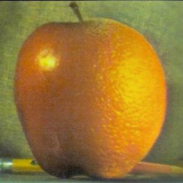
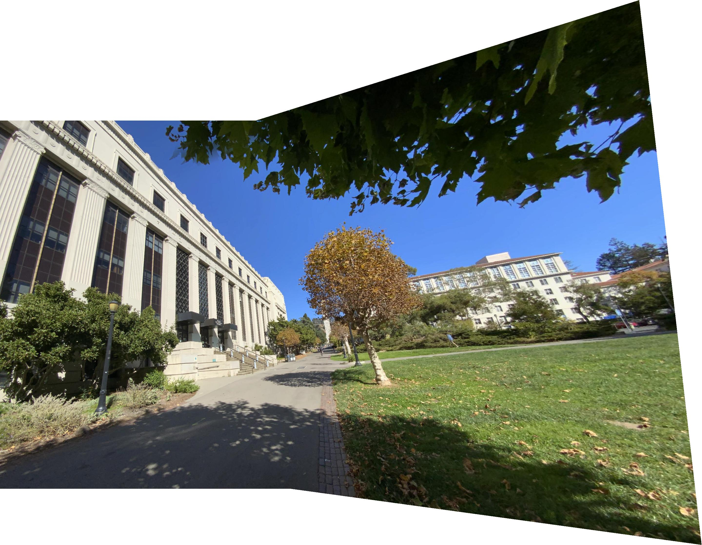
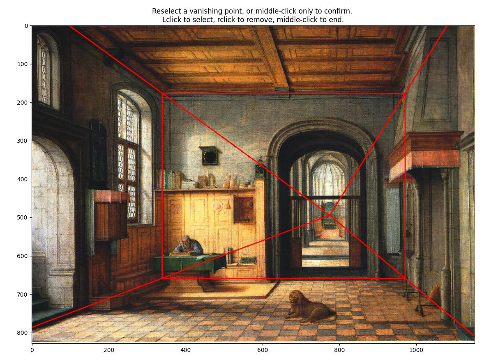

# CS 194-26 Class Projects
	
This is a series of class projects I wrote for the UC Berkeley class [CS 194-26](https://inst.eecs.berkeley.edu/~cs194-26/fa21/) (now called CS 180). 
These projects took a lot of effort and time -- reimplementing ideas from papers, taking a lot of time to debug, and just generally intensive. 
Below are links to some of them, and a link to an overview of what the project consisted of.

## [Project 1: Images of the Russian Empire -- Colorizing the Prokudin-Gorskii Photo Collection](proj1)
<a href="https://inst.eecs.berkeley.edu/~cs194-26/fa21/hw/proj1/">(project spec)</a>

Sergey Prokudin-Gorskii went around the Russian countryside in the early 20th century taking photographs onto color filtered plates. 
While he did not live to see the negatives aligned, we can align them digitally using sum-of-squared differences, aligning at increasing image resolution to reduce computation time via "image pyramids" -- generating approximations at lower resolution and then increasing the resolution to fine-tune alignment.

## [Project 2: Fun with Filters and Frequencies](proj2)
<a href="https://inst.eecs.berkeley.edu/~cs194-26/fa21/hw/proj2/">(project spec)</a>

The basics of signal processing also apply to images, which are just multi-dimensional signals.
Low-pass-filtering an image blurs it, as finer details such as edges and other rapid color changes are higher frequency. 
This project explores this concept on several images, as well as blending at different frequency levels to merge images together.

The image looks like Ranade from afar but one can see the Sahai when one looks up close.

## [Project 3: Face Morphing and Modelling a Photo Collection](proj3)
<a href="https://inst.eecs.berkeley.edu/~cs194-26/fa21/hw/proj3/">(project spec)</a>

By using a common set of annotated keypoints on human faces, one can construct a set of corresponding triangles that can morph from one face to another, using a weighted average of the triangle colors to produce an animation similar to those morph effects seen in 1990's era CGI.

## [Project 4: (Auto)stitching and photo mosaics](proj4)

<a href="https://inst.eecs.berkeley.edu/~cs194-26/fa21/hw/proj4/">(project spec)</a>

In the first half of this project, we first use known keypoints to merge images together via homographies to create panoramas.
In the second half of this project, we automatically find corresponding keypoints and filter out a useful subset with adaptive non-maximal suppression and RANSAC.

## [Project 5: Facial keypoint Detection with Neural Networks](proj5)
<a href="https://inst.eecs.berkeley.edu/~cs194-26/fa21/hw/proj5/">(project spec)</a>

Keeping up with the idea of automatically detecting keypoints, we train a convolutional neural network using PyTorch to detect a set of facial keypoints.

## [Final Project 1: Augmented Reality](projfin#proja)
<a href="https://inst.eecs.berkeley.edu/~cs194-26/sp20/hw/proj5/ar.html">(AR spec)</a>

Using an origami cube, we can easily label and track keypoints using ginput and CSRT. 
With these keypoints and homographies, we can project a rudimentary cube into the image.

<video width="640" height="360" src="projfin/projar/out/box3_cube.mp4" autoplay muted loop>
<a href="projar/out/box3_cube.mp4">box3_cube.mp4</a> 
</video>

## [Final Project 2: Tour Into The Picture](projfin#projb)
<a href="https://inst.eecs.berkeley.edu/~cs194-26/fa16/hw/proj7-stitch/proj7g/">(TIP spec)</a>

We select a back wall and a vanishing point in an image, and use this information to project a 3d model of a room from a flat image.

From this 3d model, I used pyrender and skvideo to create 3d dynamic camera tours of the constructed room. 
I had no prior experience with 3d rendering so this had a steep learning curve (i forgot that positive Y is actually up in many graphics systems, for example)

<video width="640" height="360" src="projfin/projtip/out/camera1.mp4" autoplay muted loop>
<a href="projfin/projtip/out/camera1.mp4">camera1.mp4</a> 
</video>
