# What does your project do? What design criteria must your project meet? 

The robot should be able to play chess with another human being using the pick-and-place hardware mechanism to move the pieces across the chess board. Some design criteria it must meet include the following: being able to reliably pick up pieces, being able to reliably determine the state of the board, and being able to competently plan moves. We plan specifically to make a robotic arm with no modification to the chess board to meet this criteria.

# Planning, Sensing, and Actuation

The sensing portion of the project comes from viewing the chessboard and pieces through the Pi-camera in order to understand the chess games state. Using the Stockfish engine, we will decide on the next move to play and this indicates which piece/position to pick up and move to which position, which is the planning portion. The actuation portion comes from actually moving the chess pieces across the board in a manner that can play with another human.

# The Saga of our Design

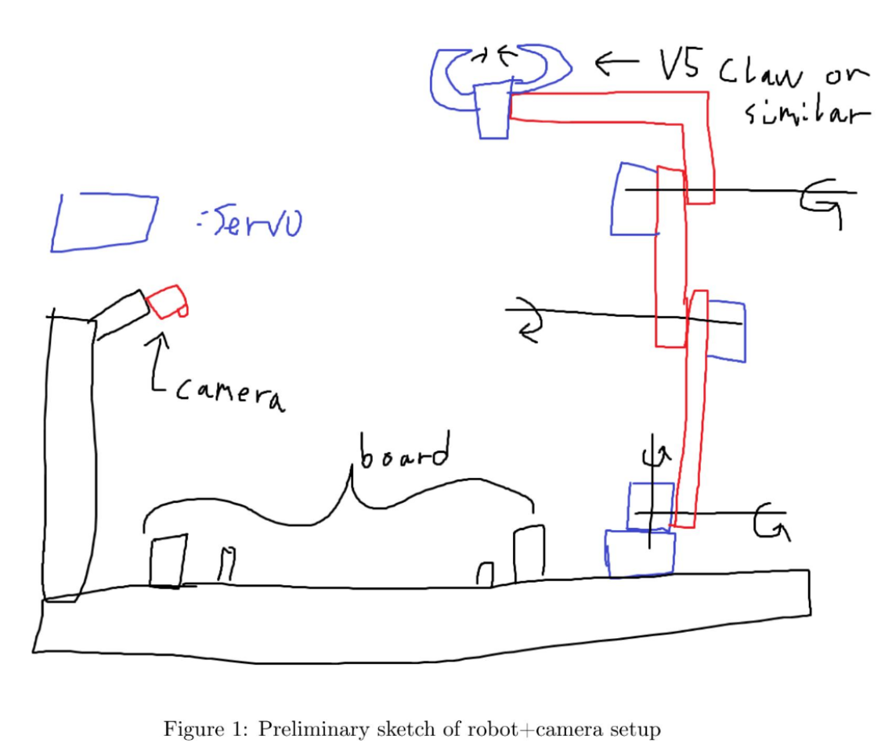

Perhaps obviously, this original design of ours ended up being quite a bit too ambitious, and over-complicated for a pick-and-place robot. Our following designs reflected that.

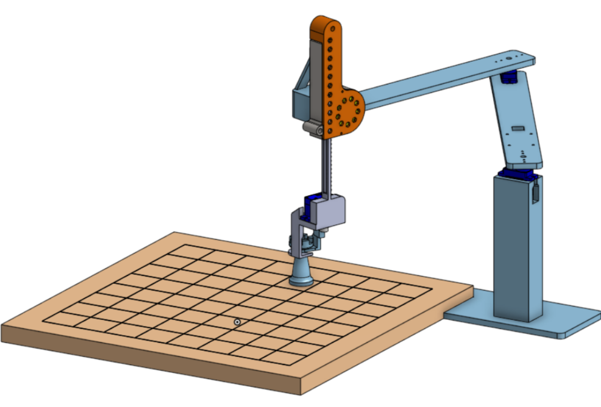

After a good period of designing in Onshape, we settled on this model to be the one we would work off of. As we waited for our 3D-printer to arrive and get setup, we began work on preparing the code.

In order to create the IK for our robot actuation, we created a corresponding URDF model.

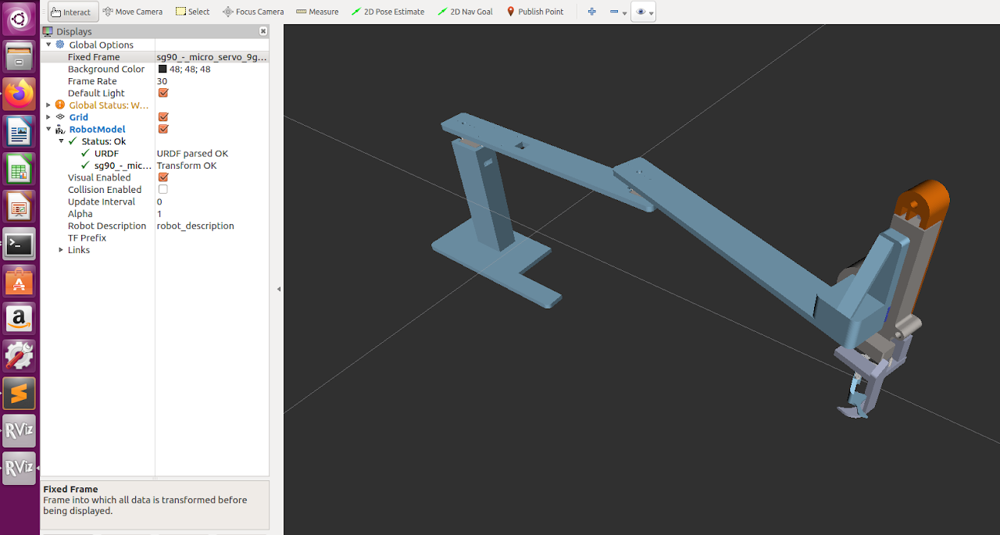

However, it turned out this design was not feasible. Microservos were not meant to be used for such heavy loads, and their pressure-joints were not capable of holding up the arms. 

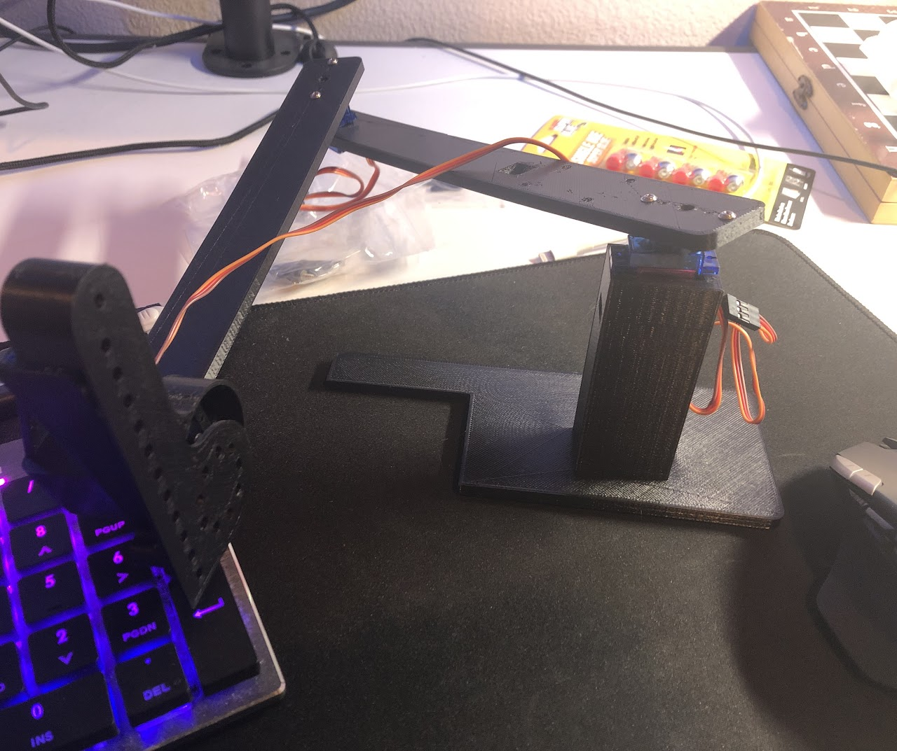

<video loop src="img/linearact.mp4">The linear actuator worked great though :) </video>

Thus, we had to go back to the drawing board. After some debate, we ended up buying parts from vendors aimed at high-school robotics competitions.

The assembly of a combination of VEX and FTC parts required awkward angles, sandpaper, and superglue. Combined with the fact that the metal c-channels we got were off-sized scrap metal cut using 2 hours with a Dremel, we decided it was better not to CAD this renewed arm design.

<video loop src="img/freehand_test.mp4"></video>
<video loop src="img/board_test.mp4"></video>

However, although the servos worked, we learned that a Raspberry Pi cannot control servos very well. GPIO-based PWM is extremely janky, and causes the arms to continually wobble and jerk randomly. Needless to say, such irregularity makes our pick-and-place mechanism impossibly inconsistent.

To solve this, we decided to invest in a strap-on PWM board. The original board we ordered was the stock blue PWM board.

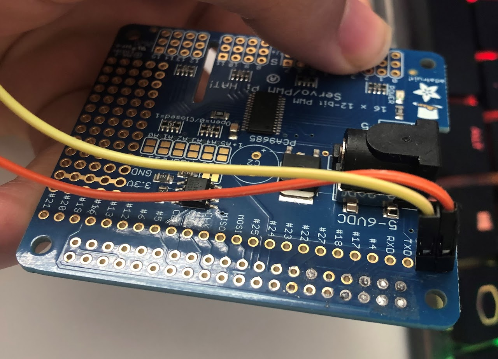

Unfortunately, this board required soldering, and we were not given access to Cory Hall's soldering irons (despite asking really nicely ):

So we decided to try soldering it ourselves using our own tools. And we accidentally destroyed the board, two weeks before the project was due.

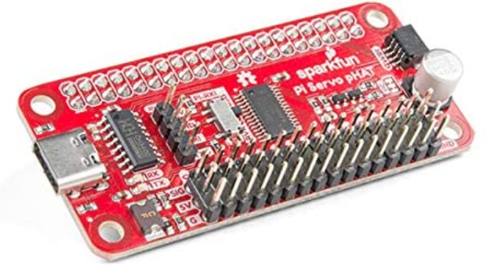

We bought a different PWM hat that did not require soldering, although we paid 15$ in shipping so that we could get it in time for our presentation deadline.

It worked wonderfully, and allowed us to finally control our robot accurately.

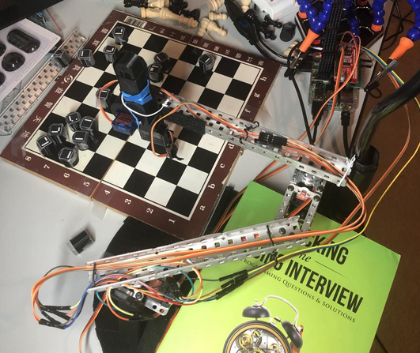

A few more oddities had to be sorted our, namely the mounting of our linear actuator (solved using rubber bands, twisty-ties, and velcro), and the stabilization of our robot base (solved using textbooks and lots of tape).

Errors were also made in the height of our base, but were solved with the addition of counterweights and newly added base platform.

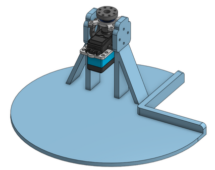
Everything else also went through a similar, if slightly less impressive, design adventure. 

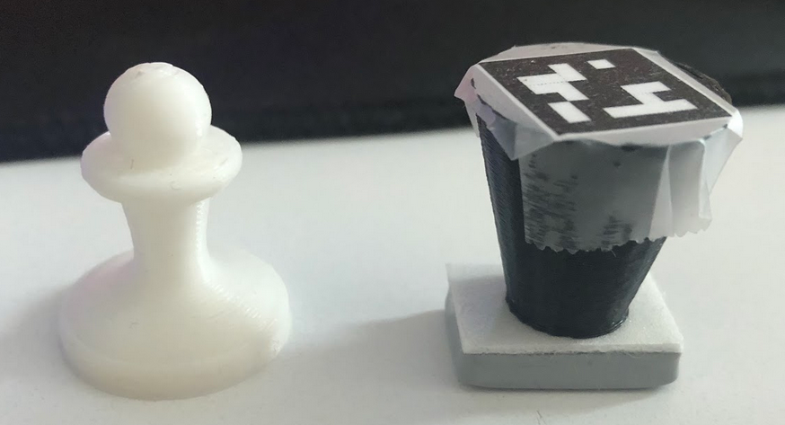

As you may have noticed in our intial CAD, we had some pretty fancy chess pieces. As you also may have noticed in our final design, we gave up on those pretty fancy chess pieces.

Above is a picture of our original pawn design next to our final pawn design. It turns out building a good recognition system, especially with so many different pieces, is very hard. Thus, we decided to attach a unique ARUCO tag to each piece to handle identification instead. We also adjusted the design to a cone to make it easier to pick-up, and glued an iron weight to the bottom of every piece to solve our tipping-problems.

# How do these design choices impact how well the project meets design criteria that would been countered in a real engineering application, such as robustness, durability, and efficiency? 

It turns out designing and thinking about a potential design is quite a lot easier than actually building a working design in reality. Our design choices, as shown above, evolved as we valued functionality over robustness and durability since we struggled for a couple of weeks to move the robotic arm. Thus, in order to get our design working and shipped out in time for the presentation deadline, robustness and durability were not valued as highly and our final designed lacked these traits. 

# The Saga of our Software

The overall sequence of events per move is as follows:

1. Robot records current board state. 
2. Robot detects the move the human made.
3. Robot uses the detected board state to calculate most optimum move.
4. Robot executes said move

We shall thus break up the following sections according to those 4 sequences.

## 1. Recording Current Board State

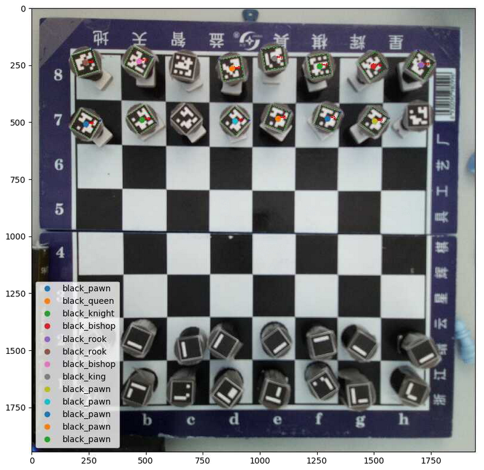

In order to accomplish this, we added a unique marker tag to every single chess piece. We used the Aruco Tag library through the OpenCV Python package to detect these markers, and return both the identity and locations of each marker. Therefore, creating the board state is then just calibrating the image to the squares on the board, then sorting the locations into the respective squares.

However, the Pi-cam is not good at focusing an image. Even after manual tuning, our captured images are still relatively blurry. This causes many tags to be missed in each image. In order to solve this, we capture 5 consecutive images, and collate the results. Thus, even if one image fails to capture a piece, it will appear in subsequent images.

Unfortunately. we were still dropping a couple pieces each pass. As a fail-safe, we simply added a user-prompt where the user could manually fix any errors in the board capture.

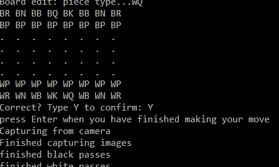

## 2. Detecting the Human Move

This was significantly easier. It simply involves repeating the capture process a second time, then comparing which squares have changed between the two moves, with allowances for edge cases such as piece capturing. A user-prompt is also included just in case the robot fails to capture the move correctly. 

## 3. Calculating Optimum Response

We used the Stockfish-12 engine for this. It is a relatively lightweight chess-playing engine with accompanying libraries that performs surprisingly well, even on a device as lightweight as a raspberry pi.

## 4. Executing the Move
This was the hardest part of the coding experience.

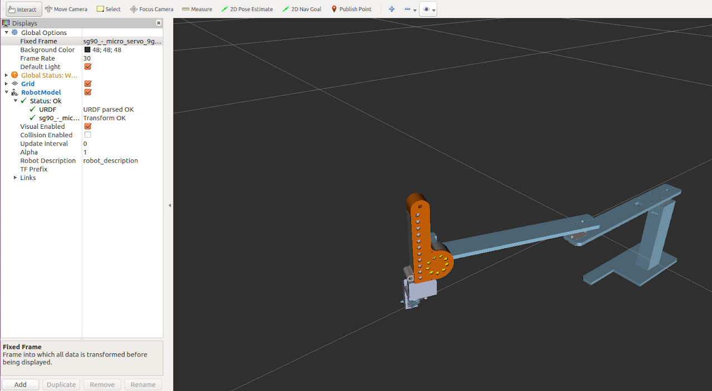

Initially, the plan was to use the URDF model that we created in order to automate our moves using Inverse Kinematics.

This ended up failing due to a variety of errors:

1. Our real-world model does not behave like our simulation model. Despite using metal parts, the entire arm still twists, bends, and sags. Even worse, the amount of sag is variable, as it will sag more depending on where it is over our chessboard. 
2. IK moves are jerky in the real-world, and not accurate enough for our pick/place.
3. Our physical design kept changing quite significantly, and we didn't want to keep updating our URDF model

Instead, we used the servo angles we generated from our original URDF model, and then manually tuned each of them for each square on our final board in order to account for all of the inaccuracies. 

# How well does it work?
It works pretty well :)

https://drive.google.com/file/d/16lzA9NrFH-yaUI_bPj8c9f4X90V0aXQi/view?usp=sharing

We were able to accomplish all of our design goals, all the way from detecting pieces/moves to planning and executing smart responses automatically. 
Unfortunately, getting to this point required a significant number of hacks in order to get this to work, and the overall system can still be more consistent, durable and robust. 

# Conclusion

Our original design goal was to create a robot that could "play chess with another human being using the pick-and-place hardware mechanism to move the pieces across the chess board". We can say that our Project hits this design goal as seen in the video above. 

Despite being quite happy at meeting all of our design goals (the robot being able to play chess against a human), we are bummed at the number of hacks it required to get to this point. Although a lot of it can be attributed to lost time from COVID-difficulties and hardware bugs, there is a lot more we are planning on doing over winter break.

First, we want to edit our physical design a good bit. Our claw mechanism ended up being the subject of an entire week of pain. We would like to replace it with an electromagnet instead, and embed a small metal piece into each chess piece. Additionally, once inventory permits, we want to buy some actual mounting hardware for our arm, and stop using dremeled c-channels held together with superglue, rubber bands, and hope. 

Secondly, we want to overhaul our software for consistency. Our code is more reminiscent of a hackathon than a shippable product. We are especially sad at our hardcoded controls. After we fix our physical design to be more robust and reliable, we would like to see if we could fix our URDF model to account for the variable sag, and get inverse kinematics working in the real-world. Our vision code also has a lot of room for improvement as it can be inconsistent in reading the board state. We could add a high-pass filter to our vision system to better read the tags to understand the board more consistently.