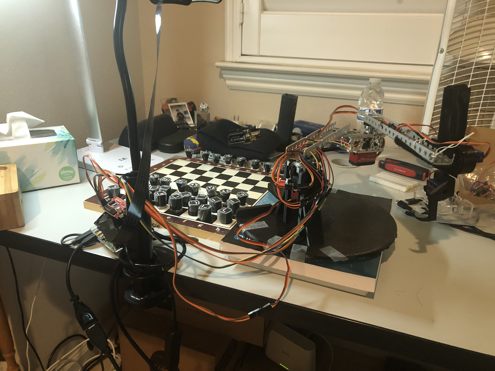

# Introduction

The end goal of our project was to build a robot that could play chess automatically. 
A couple key points was that the robot needed to be able to recognize moves that the human opponent made based on vision alone, needed to be able to move pieces autonomously, and needed to be able to plan moves effectively. 
This ended up being an absolute adventure, as all but the third point ended up being a lot harder than planned. 
We ended up going through many different iterations of our design in order to finally arrive at a robot that could reliably pick up pieces, and a piece design that could reliably be recognized. 
This was compounded even further by the difficulties of COVID preventing us from meeting in person. 

# Why is your project interesting? 

<video loop src="img/pick_and_place.mp4"></video>

It’s an automatic chess playing robot!
And, even better, it’s 3d printed, using a super common Raspberry Pi and associated Pi camera.
Putting this all together alongside the code in Github should allow nearly anyone to build their own chess playing robot themselves!
Not only that, it’s guaranteed to be able to beat almost any human player as the robot uses the well-known StockFish engine.

# What potential social, political, environmental and economic impacts could your project make?

Although not immediately obvious, the design of a robot such as this can be easily adapted into other similar pick-and-place mechanisms. Industrial settings where large quantities of small objects must be placed into specific locations (perhaps in chocolate box packing) are the clear next steps for an accurate picker/placer such as our robot. 

Robots with similar designs are often useful in rescue environments, where moving obstacles from one place to another where humans cannot reach can save lives. Similarly, the idea of pick-and-place mechanism can be used in the medical field for surgical robots. 

It's also to note that many areas of entertainment are using or could use similar forms of intelligent automation, and similar applications will rise in need.

[back to index](./index)