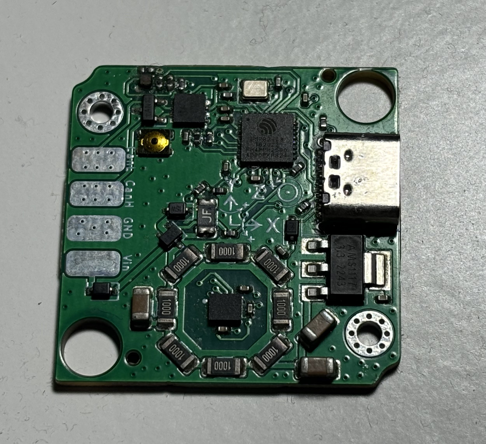

# canandgyro

so after our first ventures into making hardware with esp32-c3 chips, we tried our hand at making a gyro. 

## the first proto

our initial attempt was to make a gyro still using an esp32c3 and it looked something like this: 

The first thing you'll notice tis that it has a ring of 8 resistors around the actual IMU IC. 
that was to act as a heater to temperature-stabilize the IMU. 

but it turns out that didn't really have much of an effect. we threw it into a walk-in freezer but it didn't really do much.

## the bigger problem: the esp32c3 itself

The esp32c3 is a nice chip for IoT. It has a staggeringly large 4mb qspi flash that lets you read and write to it without stalling your processor (unlike many mid-lower end stm32s -- this is why the Rev Spark Max needs a `burnFlash()` function), and also lets you do A/B firmware updates. Its C++ HAL is one of the best-documented in the entire space. And to top it all off, it makes Wi-Fi easy, which is how Espressif has managed to stake out a solid market position for itself beyond the many, _many_ other Chinese chip designers trying to get a slice of the microcontroller market.

But we're trying to make a gyroscope here so that FRC teams can press forward on a joystick and have their swerve drive go down-field no matter which way the robot is rotated. And at the end of the day, what really matters is how well the integration algorithm performs. And the esp32c3 has one critical flaw: **it lacks a floating point unit.** 

The ESP32 also:
* doesn't have a digital-to-analog converter, meaning we can't use it in an FTC context without adding more parts as they require analog sensors for [silly control system reasons]
* has a hard-block USB peripheral so we can't implement our own USB devices on top; we tried using the USB-CDC serial it exposes over JTAG for SLCAN as an experiment and it just wasn't reliable enough
* has overly abstracted drivers in its HAL much more tailored to basic IoT use than high-performance usage that we desire.
* the HAL also generates ridiculously large firmware images. Canandmag had firmwares that were **250k** in size, which is also why it takes forever to update.

## so we ditched it.

...in favor of a GigaDevices GD32C103 -- a cheap, Cortex-M4F based processor. It has less RAM and flash than the esp32, but it has a single-precision FPU, an actual Synopsys-derived USB-OTG IP block, and the ability to more easily DMA SPI. It's basically an STM32 but made on Chinese fabs and without any of the traditional software support of an STM32. 

## let's also switch programming languages too

yeah so for [variety of reasons] around late 2023 we decided to switch from C++ to Rust for new hardware. We were initially skeptical of Rust because we felt that memory safety wasn't _particularly_ important in embedded when you don't have dynamic allocation (which you really shouldn't have) and Rust can't (and basically won't touch) memory safety with peripherals like DMA. 

Nevertheless we still decided to give it a try for a few reasons:
* Rust has much better packaging than C++ does, and better/more packaging means it's easier to test and isolate code in bench/unit tests compared to C++. 
  * Rust's packaging being good has knock-on effects on the entire embedded ecosystem as well -- a lot of Rust HALs for chips look and act very similar to each other in part due to `embedded-hal` existing and having a good package ecosystem overall vibes better
* Proc macros let us define message protocols in configuration files rather than hardcoded in or generated with Python scripts, although I personally don't like macros and think that compile-time reflection should be a thing
* Rust code lends itself to be more readable overall -- you get a lot more contextual type and data information about the code you're working with because of sum type enums, slices, and traits. Functional C++ Intellisense feels like an unsolved problem in computer science to get working. 

But perhaps the most compelling reason was because of RTIC, which is perhaps the best RTOS you can get without paying money.

For more on my thoughts on embedded rust, see [here](embedded_rust.md)

## the end result (WIP)
